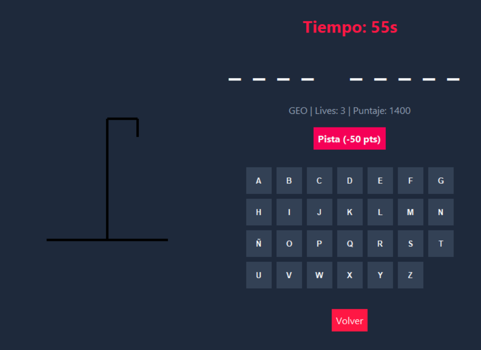

# Ahorcado GUI App POO

## Descripción
Implementación del Ahorcado con interfaz Tkinter y organización orientada a objetos. Separa ventanas, componentes, lógica y datos.

## Objetivo
Practicar POO aplicada a interfaces gráficas y gestión de estado de una aplicación desktop.

## Tecnologías utilizadas
- Python 3
- Tkinter
- POO
- Archivos .txt

## Funcionalidades principales
- Juego gráfico de Ahorcado
- Gestión administrativa
- Modos de juego e historial
- Estructura modular de pantallas

## Mi rol
Diseñé la estructura POO, implementé pantallas y conecté componentes visuales con la lógica.

## Aprendizajes clave
- POO aplicada a GUI
- Gestión de estado
- Reutilizacion de componentes
- Organización por subpaquetes

## Instalación y ejecución
```bash
cd Ahorcado-GUI-App-POO/programa
python main.py
```

## Estructura del proyecto
- programa/main.py: entrada
- programa/src/gui/: pantallas
- programa/src/logic.py: reglas
- programa/data/: datos

## Capturas o demo


## Estado del proyecto
Proyecto académico funcional.

## Valor técnico demostrado
Muestra diseño modular, uso de POO y construccion de interfaces desktop.

## Mejoras futuras
- Agregar pruebas
- Mejorar empaquetado
- Incluir guía visual

## Autor
Geovanni González  
Estudiante de Ingeniería en Computación  
GitHub: [Geovanni-Gonzalez](https://github.com/Geovanni-Gonzalez)


